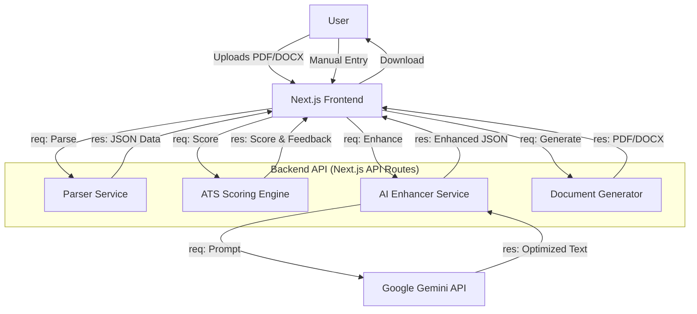

# WhizResume — AI-Powered Resume Builder & ATS Optimizer

WhizResume is a modern, full-stack web application designed to help job seekers create professional, ATS-optimized resumes. It leverages **Google Gemini AI** for intelligent content enhancement and **Next.js** for a high-performance, responsive user experience.

## 🚀 System Architecture & Flow

The application follows a modern **Client-Server-AI** architecture:



### Core Workflow
1.  **Input**: User uploads a resume (PDF/DOCX) or enters details manually.
2.  **Parsing**: The backend extracts text and structured data using `pdf-parse` and `mammoth`.
3.  **Scoring**: The **ATS Engine** evaluates the resume against 500+ keywords, formatting rules, and readability metrics.
4.  **AI Enhancement**: High-impact improvements (action verbs, quantifiable results) are generated via **Gemini 1.5**.
5.  **Generation**: The final resume is compiled into a polished **PDF** or **DOCX** using professional templates.

---

## 🛠️ Tech Stack

### Frontend
-   **Framework**: [Next.js 14](https://nextjs.org/) (App Router)
-   **Language**: TypeScript
-   **Styling**: Tailwind CSS + Custom Design System (Slate/Blue Theme)
-   **Icons**: Lucide React
-   **State Management**: React Hooks

### Backend
-   **Runtime**: Node.js (Next.js API Routes)
-   **AI Model**: Google Gemini Pro (via `@google/generative-ai`)
-   **Parsing**: `pdf-parse`, `mammoth`
-   **Generation**: `docx` (Word), `puppeteer` (PDF)

### Deployment
-   **Platform**: Render / Vercel
-   **Build**: Docker Container (Standalone Output)

---

## ✨ Key Features

-   **📄 Universal Support**: Parses both PDF and DOCX formats.
-   **🎯 Real-Time ATS Scoring**: Instant feedback on resume strength (0-100).
-   **🤖 AI Content Polish**: Re-writes bullet points to be impact-driven.
-   **🎨 Professional Templates**: Select from Classic, Modern, and Creative layouts.
-   **📱 Mobile Optimized**: Fully responsive design for editing on the go.
-   **🔍 SEO Friendly**: Structured JSON-LD data for better search visibility.

---

## 📂 Project Structure

```
├── src/
│   ├── app/                 # Next.js App Router
│   │   ├── api/             # Backend API Endpoints
│   │   │   ├── parse/       # File Parsing Logic
│   │   │   ├── generate/    # Document Generation
│   │   │   └── enhance/     # AI Integration
│   │   ├── builder/         # Resume Builder UI
│   │   └── page.tsx         # Landing Page
│   ├── components/          # Reusable UI Components
│   └── lib/                 # Core Business Logic
│       ├── ats-scorer.ts    # Scoring Algorithm
│       ├── ai-enhancer.ts   # Gemini Prompts
│       └── templates/       # Resume Template Definitions
├── public/                  # Static Assets
├── next.config.mjs         # Build Configuration
└── package.json            # Dependencies
```

---

## 🏁 Getting Started

### Prerequisites
-   Node.js 18+
-   Google Gemini API Key

### Installation

1.  **Clone the repository**:
    ```bash
    git clone https://github.com/your-username/ats-agent.git
    cd ats-agent
    ```

2.  **Install dependencies**:
    ```bash
    npm install
    ```

3.  **Configure Environment**:
    Create a `.env.local` file:
    ```env
    GEMINI_API_KEY=your_gemini_api_key
    ```

4.  **Run Development Server**:
    ```bash
    npm run dev
    ```
    Open [http://localhost:3000](http://localhost:3000).

---

## 🚀 Deployment

The project is optimized for **Render** deployment.

1.  Push code to GitHub.
2.  Connect repository to Render.
3.  Set `Build Command`: `npm run build`
4.  Set `Start Command`: `npm start`
5.  Add `GEMINI_API_KEY` in Environment Variables.

The `next.config.mjs` is configured with `output: 'standalone'` for efficient Docker builds.
